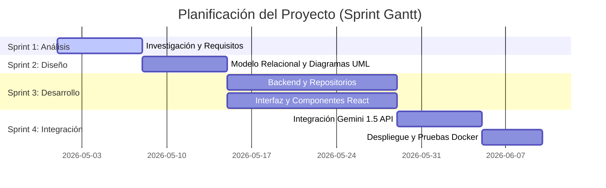
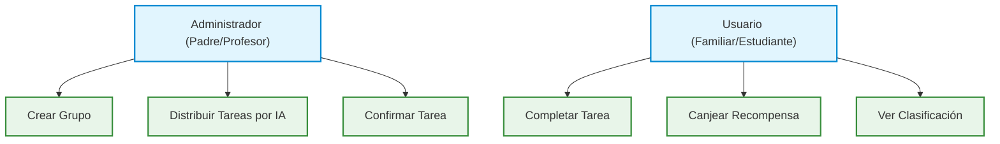
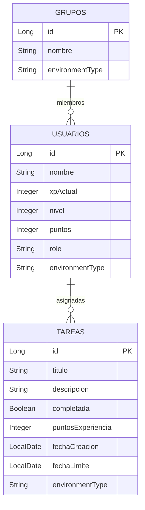
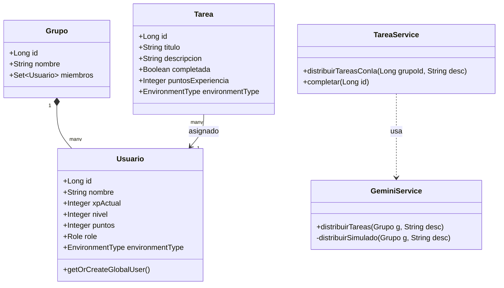
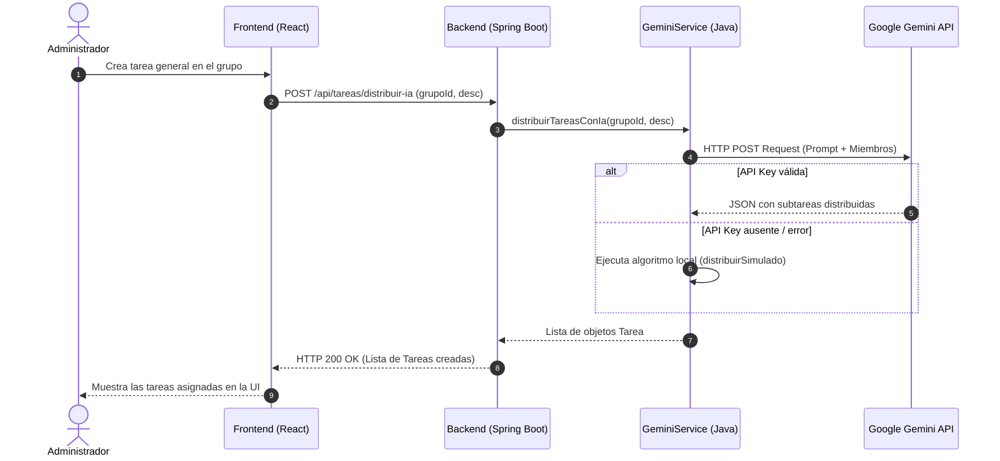

# Capítulo 4
## Metodología y Resultados

### 4.1.- Planificación del Proyecto (Metodología Ágil)
El desarrollo del proyecto se estructuró en 4 Sprints principales utilizando un enfoque iterativo incremental basado en Scrum:
* **Sprint 1 (Análisis)**: Captura de requisitos y diseño inicial del sistema.
* **Sprint 2 (Diseño)**: Definición del modelo relacional de base de datos y diagramación UML.
* **Sprint 3 (Desarrollo)**: Programación del backend de Spring Boot, repositorios JPA e interfaz de React.
* **Sprint 4 (Integración)**: Integración con la API de Google Gemini, lógica de fallbacks locales y pruebas unitarias de extremo a extremo.

#### Figura 4.1.- Diagrama de Gantt de Planificación de Sprints

---

### 4.2.- Captura de Requisitos
El sistema gestiona de manera diferenciada los privilegios del creador del grupo (administrador) y el resto de integrantes asignados.

#### Figura 4.2.- Diagrama de Casos de Uso del Sistema

---

### 4.3.- Diseño del Sistema

#### 4.3.1.- Diagrama Entidad-Relación de la Base de Datos
La persistencia de datos se compone de tablas relacionadas para guardar el progreso del jugador, el contenido de las misiones y la composición de los grupos de trabajo.

#### Figura 4.3.- Diagrama Entidad-Relación

---

#### 4.3.2.- Diagrama de Clases UML
El diseño orientado a objetos del backend de Spring Boot se estructura en tres capas (Controladores, Servicios y Entidades JPA).

#### Figura 4.4.- Diagrama de Clases UML

---

#### 4.3.3.- Diagrama de Secuencia: Petición de Distribución de Tareas por IA
Este diagrama detalla el ciclo de vida de una petición HTTP iniciada desde el panel del frontend al pulsar "Distribuir por IA".

#### Figura 4.5.- Diagrama de Secuencia UML

---

### 4.4.- Implementación y Resultados
* **Frontend**: La aplicación implementa un diseño interactivo que actualiza los datos de nivel y XP del usuario inmediatamente al marcar tareas como realizadas. Se implementaron modales interactivos para ver detalles de logros bloqueados y animaciones de confeti con la librería nativa CSS al canjear recompensas.
* **Backend**: Inicializa datos en la base de datos a través de `DataInitializer` para que la aplicación muestre registros representativos de tareas y usuarios de clasificación al iniciar por primera vez.
