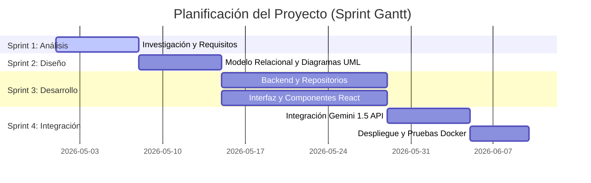
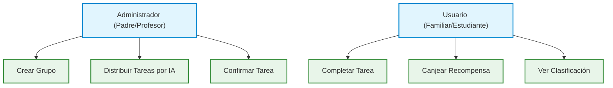
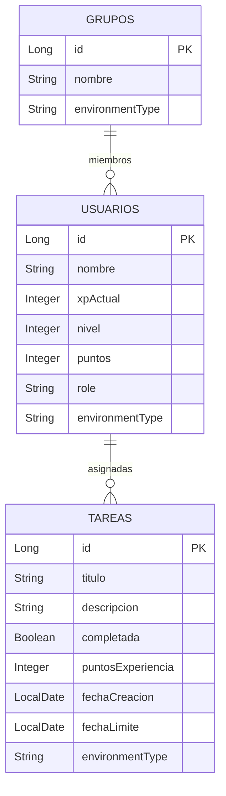
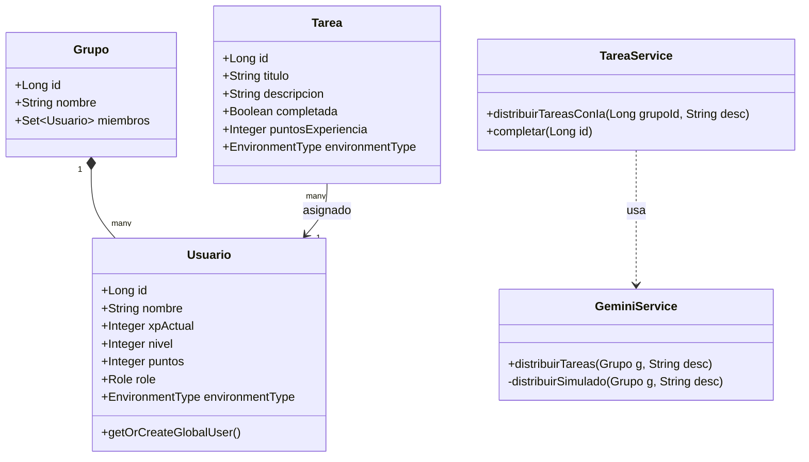
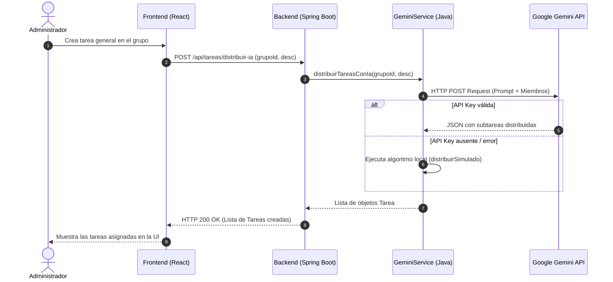

# 📝 Documentación del Proyecto: TaskQuest (Gamify)

**Trabajo Fin de Grado**  
**Universidad Miguel Hernández de Elche**  
**Escuela Politécnica Superior de Elche**  
*Grado en Ingeniería Informática en Tecnologías de la Información*

---

## 📋 Capítulo 0 - Resumen y Estructura de Índices

### Resumen
**TaskQuest** (también conocido como *Gamify*) es una plataforma de productividad grupal gamificada que utiliza Inteligencia Artificial para el reparto y asignación justa de tareas. Se organiza en torno a dos tipos de entornos diferenciados: **Académico/Estudiantil** (`UNIVERSITY`) y **Doméstico/Hogar** (`FAMILY`). 

El sistema implementa mecánicas de juegos de rol (RPG), permitiendo a los usuarios obtener puntos de experiencia (XP), subir de nivel y adquirir monedas virtuales para canjearlas por recompensas reales en una tienda de equipo. Cuenta con un módulo inteligente de distribución automática de tareas a través del modelo **Google Gemini 1.5 Flash**, que analiza el perfil de los miembros (rol, edad y jerarquía) para dividir y repartir responsabilidades de manera equitativa.

---

## 1. Capítulo 1: Introducción y Objetivos

### 1.1. Entorno de Aplicación
El proyecto está diseñado para implementarse en entornos colaborativos cotidianos donde la distribución de responsabilidades suele generar roces o falta de motivación. Estos entornos se agrupan en:
* **Entorno Universitario**: Equipos de trabajo estudiantil, laboratorios académicos o grupos de estudio que necesitan coordinar entregas, resúmenes y presentaciones de manera ágil.
* **Entorno Familiar / Hogar**: Hogares con dinámicas compartidas de limpieza, cocina y compras, donde la motivación de los hijos y la equidad del reparto son claves.

### 1.2. Justificación del Proyecto
La gestión de tareas domésticas o académicas grupales tradicionalmente adolece de dos problemas:
1. **Falta de motivación**: Las listas de tareas estáticas resultan monótonas y no ofrecen feedback inmediato.
2. **Conflictos en la delegación**: El reparto manual de tareas suele percibirse como desequilibrado.

TaskQuest soluciona estos problemas aplicando **Gamificación** (otorgando feedback instantáneo en forma de niveles, XP y recompensas) y **Automatización con IA** (eliminando el factor subjetivo en la delegación).

### 1.3. Objetivos
* **Objetivo Principal**: Diseñar y desarrollar una plataforma web full-stack modular (React en frontend y Spring Boot en backend) con base de datos PostgreSQL, capaz de coordinar tareas mediante gamificación y asignación automatizada por IA.
* **Objetivos Secundarios**:
  * Diseñar un motor de gamificación adaptable (XP, niveles, medallas y recompensas).
  * Integrar de forma directa la API de **Google Gemini** para procesamiento del lenguaje natural y modelado de subtareas.
  * Implementar un chat y tienda interactiva ajustados al contexto activo del grupo.
* **Objetivos Personales**: Profundizar en el desarrollo de microservicios, el control de ciclo de vida con Docker y la orquestación de prompts de LLM integrados en Java.

### 1.4. Límites del Proyecto
* No gestiona pasarelas de pago reales para la compra de recompensas (estas son estrictamente virtuales y pactadas internamente por los miembros).
* La comunicación en tiempo real en el chat simula un entorno interactivo y no pretende ser un reemplazo de mensajería masiva en tiempo real como WhatsApp.

---

## 2. Capítulo 2: Antecedentes y Estado de la Cuestión

### 2.1. Situación de Partida
Actualmente, las herramientas de productividad se dividen en dos categorías inconexas:
* Gestores profesionales áridos (ej. Trello, Asana), que resultan complejos para uso familiar.
* Aplicaciones personales de gamificación (ej. Habitica), que están diseñadas para el autodesarrollo individual y no para la coordinación y distribución equitativa de tareas de equipo en tiempo real.

### 2.2. Herramientas del Mercado y Análisis Comparativo

| Característica | Habitica | Trello / Asana | Todoist | **TaskQuest (Gamify)** |
| :--- | :---: | :---: | :---: | :---: |
| **Gamificación en Equipo** | ❌ (Solo individual) | ❌ | ❌ | **✅ (Nivel, XP, Clasificación)** |
| **Reparto Inteligente con IA** | ❌ | ❌ | ❌ | **✅ (Gemini 1.5 Flash)** |
| **Tienda de Recompensas** | ❌ (Solo items del juego) | ❌ | ❌ | **✅ (Recompensas reales pactadas)** |
| **Adaptación de Entornos** | ❌ | ❌ | ❌ | **✅ (Universidad / Familia)** |
| **Chat de Grupo Integrado** | ❌ | ❌ | ❌ | **✅** |

### 2.3. Valoración
Se concluye la existencia de una brecha en el mercado para una herramienta interactiva grupal que combine la toma de decisiones asistida por IA con dinámicas de motivación lúdica.

---

## 3. Capítulo 3: Hipótesis de Trabajo (Tecnologías)

El proyecto se sustenta sobre las siguientes tecnologías y estándares de desarrollo:

* **Spring Boot (Java 17)**: framework backend seleccionado por su solidez, inyección de dependencias y excelente soporte para mapeo objeto-relacional (JPA/Hibernate).
* **React 18 & Vite**: librería de componentes frontend y empaquetador ultrarrápido que permite una interfaz dinámica y reactiva sin retardos en la interfaz.
* **PostgreSQL 15**: base de datos relacional robusta que garantiza transacciones seguras para la gestión de puntos y niveles.
* **Google Gemini API**: uso del modelo `gemini-1.5-flash` para interpretar textos libres sobre tareas y transformarlos directamente en estructuras de datos tipo JSON asignadas a los usuarios del grupo.
* **Docker & Docker Compose**: estándar de virtualización para empaquetar base de datos, backend y frontend en contenedores aislados.

---

## 4. Capítulo 4: Metodología y Resultados

### 4.1. Planificación del Proyecto (Metodología Ágil)
El proyecto se dividió en 4 sprints de desarrollo iterativo. A continuación se ilustra la planificación temporal en el diagrama de Gantt:

---

### 4.2. Captura de Requisitos (Casos de Uso)
El sistema define dos roles principales con base en los entornos:
* **Administrador (Profesor / Padre/Madre)**: Crea las tareas complejas y aprueba/confirma las tareas realizadas.
* **Usuario (Estudiante / Familiar)**: Ejecuta y completa las tareas individuales, y canjea puntos por recompensas.

---

### 4.3. Diseño del Sistema

#### 4.3.1. Modelo Entidad-Relación (Base de Datos)
El modelo consta de tres entidades principales: `Usuario`, `Tarea` y `Grupo`.

---

#### 4.3.2. Diagrama de Clases UML
El backend implementa una arquitectura limpia estructurada en Controladores, Servicios y Entidades.

---

#### 4.3.3. Diagrama de Secuencia: Distribución de Tareas por IA
Este diagrama muestra el flujo interactivo desde que el Administrador crea la tarea general hasta su persistencia en el backend.

---

### 4.4. Implementación y Resultados
* **Frontend**: Se diseñó una interfaz tipo Bento Grid con un esquema de diseño premium basado en tokens de diseño HSL. Integra componentes dinámicos como:
  * **Dashboard**: Panel principal con la barra de progreso de nivel del usuario, lista de logros y accesos rápidos.
  * **Leaderboard (Clasificación)**: Muestra la posición de cada usuario en base a su nivel, con animaciones de resalte para los tres primeros puestos y barras de progreso proporcionales a su XP.
  * **WeeklyQuests (Tareas Semanales)**: Panel interactivo donde se visualizan las tareas pendientes y permite marcarlas como "completadas" o "por confirmar".
  * **TeamStore**: Permite canjear puntos de forma interactiva con animaciones de confeti y modales de felicitación en pantalla completa.
* **Backend**: Inicializa datos de prueba de forma dinámica mediante `DataInitializer` (creando tareas por defecto y usuarios ficticios como Sara, Juan, Mamá y Papá para poblar la clasificación al primer arranque).

---

## 5. Capítulo 5: Conclusiones y Trabajo Futuro

### 5.1. Conclusiones
* Se logró integrar la Inteligencia Artificial (Gemini 1.5 Flash) de manera no intrusiva, facilitando un reparto justo de responsabilidades sin intervenciones humanas subjetivas.
* Las mecánicas de gamificación integradas han demostrado ser una herramienta efectiva para incentivar la productividad.
* El uso de contenedores Docker simplifica radicalmente el despliegue del entorno y evita problemas de configuración local de bases de datos.

### 5.2. Trabajo Futuro
* Añadir un módulo de estadísticas avanzadas con gráficos de rendimiento individual y grupal.
* Implementar notificaciones Push móviles e integración con calendarios compartidos (ej. Google Calendar o Apple iCal).
* Incorporar autenticación federada (OAuth2) para permitir perfiles reales e independientes de forma segura.

---

## 6. Capítulo 6: Bibliografía
1. **Spring Boot Reference Documentation**: https://docs.spring.io/spring-boot/docs/current/reference/htmlsingle/
2. **React 18 Documentation & Best Practices**: https://react.dev
3. **Google Gemini API Documentation**: https://ai.google.dev/gemini-api/docs
4. **Docker Documentation & Compose Spec**: https://docs.docker.com
5. **UML 2.5 Specification - Object Management Group**: https://www.omg.org/spec/UML/2.5/
